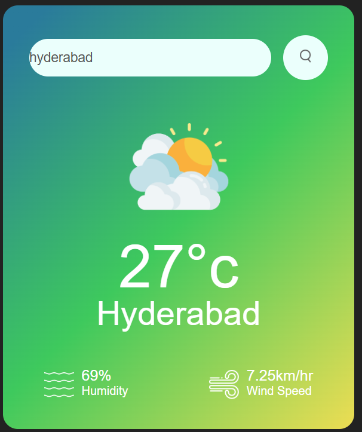
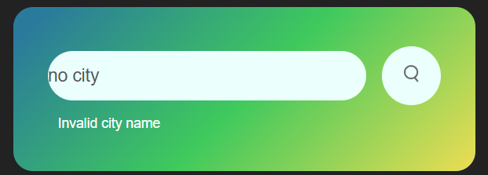

# live : https://weather-climateapp-javascript.netlify.app/

# 🌤️ Weather Temperature App

A simple and responsive weather application built using **HTML**, **CSS**, and **JavaScript**. It allows users to search for any city and displays the current temperature along with weather conditions using real-time API data.

## 🔧 Features

- Get real-time temperature for any city
- Displays weather condition (sunny, cloudy, rainy, etc.)
- Responsive and user-friendly UI
- Uses OpenWeatherMap API (or any weather API of your choice)

## 🛠️ Technologies Used

- HTML
- CSS
- JavaScript
- [OpenWeatherMap API](https://openweathermap.org/api)

## 📷 Preview

 <!-- Replace with your screenshot if available -->

## 🚀 How to Run the Project

1. Clone the repository:

git clone https://github.com/anilKumar-9/Javascript-Projects/Weather-Project.git

Copy
Edit

2. Open `index.html` in any browser.

> ⚠️ You may need an API key from OpenWeatherMap to make the app work.

## 📁 Project Structure

/weather-app
│
├── index.html
├── style.css
├── script.js
└── README.md

Copy
Edit

## 📌 Future Improvements

- Add 5-day forecast
- Add background animations based on weather
- Improve UI with more styling and icons

## 🙋‍♂️ Author

**Anil Kumar**

---

Feel free to modify it based on your project's actual structure or features. Would you like a fancier v